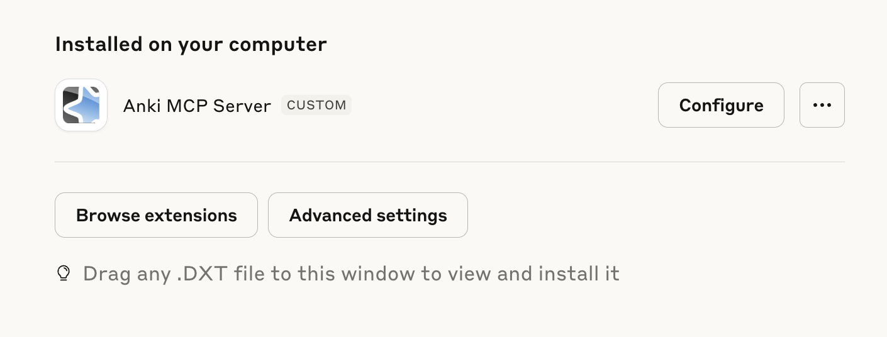

# mcp-anki-server

## prerequisite

- [Anki Desktop](https://apps.ankiweb.net/)
- [Anki Connect](https://ankiweb.net/shared/info/2055492159)
- [uv](https://docs.astral.sh/uv/getting-started/installation/)


## usage

### Claude Desktop



1. Download the dxt package from [releases](https://github.com/cdpath/mcp-server-anki/releases/tag/0.3.0)
2. (macOS) fix executable permission by `chmod +x "$HOME/Library/Application Support/Claude/Claude Extensions/local.dxt.cdpath.mcp-server-anki/server/mcp-server-anki-go"`

### cursor

update `.mcp.json` to add the following:

```
{
    "mcpServers": {
      "anki": {
        "command": "uvx",
        "args": ["mcp-server-anki"],
        "env": {},
        "disabled": false,
        "autoApprove": []
      }
    }
}
```

### chatwise

Go to Settings -> Tools -> Add and use the following config:

```
Type: stdio
ID: Anki
Command: uvx mcp-server-anki
```


## local development

```
uv --directory $HOME/Developer/mcp-server-anki/src/mcp_server_anki run server.py
```